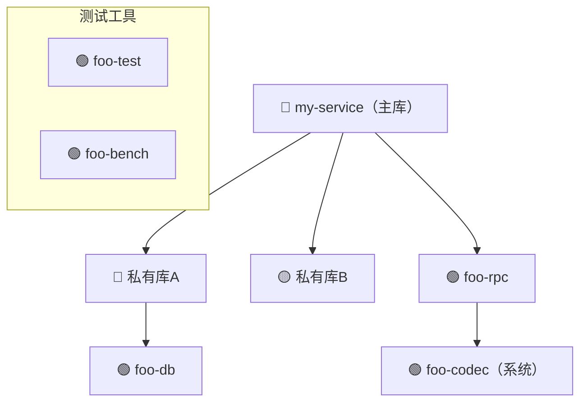

# C++ 项目依赖分析

支持以下 C++ 构建系统的依赖分析：

| 系统 | 关键文件 | 依赖声明方式 |
|------|----------|-------------|
| **Bazel** | `WORKSPACE`, `*.BUILD` | `http_archive`, `git_repository`, `new_local_repository` |
| **CMake** | `CMakeLists.txt`, `cmake/*.cmake` | `FetchContent_Declare`, `ExternalProject_Add`, `find_package` |
| **Git Submodule** | `.gitmodules` | `[submodule]` |
| **手动脚本** | `*.sh`（`wget`/`curl`） | 直接下载 URL |
| **系统包管理** | `*.sh`（`yum`/`apt`） | `yum install`, `apt-get install` |

---

## 分析流程

### 第一步：识别构建系统

```bash
# 检测项目使用哪种构建系统（可能同时存在多种）
find <项目根目录> -maxdepth 3 \
  \( -name "WORKSPACE" -o -name "CMakeLists.txt" \
  -o -name ".gitmodules" -o -name "*.sh" \) | sort
```

### 第二步：优先扫描并初始化 Git Submodules

**最先处理**，因为子模块通常是核心依赖且版本固定。

#### 2a. 初始化并拉取子模块

```bash
# 读取子模块列表（先检查是否存在）
cat .gitmodules 2>/dev/null || echo "无子模块"

# 初始化并递归拉取所有子模块（若尚未 clone）
# --init：初始化未初始化的子模块
# --recursive：同时处理子模块中的子模块
git submodule update --init --recursive

# 获取每个子模块当前 commit
git submodule status --recursive
```

> ⚠️ 如果网络受限或权限不足导致 clone 失败，记录失败的子模块 URL，
> 在报告中标注「⚠️ 无法克隆，跳过子仓依赖分析」，继续分析其余依赖。

#### 2b. 检查子模块 ARM 兼容性

```bash
# 获取子模块所有分支（检查是否有 ARM 相关分支）
git submodule foreach 'git branch -a | grep -iE "arm|aarch64|kunpeng" || echo "[无 ARM 分支] $name"'

# 检查子模块提交历史中的 ARM 关键字
git submodule foreach 'git log --oneline --all | grep -iE "arm|aarch64|kunpeng|cross.?compil" | head -5 || echo "[无 ARM 提交] $name"'
```

对每个子模块记录：URL、当前 commit、对应的上游 tag（若有）。

### 第三步：按构建系统解析其余依赖

#### Bazel（`WORKSPACE` 文件）

| 规则 | 分类 | 说明 |
|------|------|------|
| `git_repository` / `new_git_repository` | 远端 Git（有源码） | 记录 remote、tag/commit |
| `http_archive` | HTTP 下载 | 检查 BUILD 文件判断是否预编译 |
| `new_local_repository` | 本地系统依赖 | 记录路径 |

**识别 `http_archive` 预编译包**（检查对应 `.BUILD` 文件）：
- `srcs = glob(["lib/**/*.so*"])` 或 `glob(["lib64/lib*.a*"])` → 预编译库
- `filegroup` 指向 `bin/` → 预编译可执行文件
- 无 `.cc`/`.cpp` srcs → 无源码

#### CMake

```cmake
# FetchContent —— 有源码，拉取后本地编译
FetchContent_Declare(foo GIT_REPOSITORY https://... GIT_TAG v10.0.0)

# ExternalProject —— 有源码，独立构建
ExternalProject_Add(lib URL https://...lib-1.3.tar.gz)

# find_package —— 依赖系统预装库，无源码管理
find_package(OpenXXX REQUIRED)
```

#### Shell 脚本手动下载

```bash
grep -rn "wget\|curl" *.sh scripts/ 2>/dev/null
grep -rn "yum install\|apt-get install\|apt install" *.sh scripts/ 2>/dev/null
```

### 第四步：识别私有依赖

判断一个依赖的 URL 是否为**私有地址**：

| URL 特征 | 判断 |
|----------|------|
| `github.com`、`gitlab.com` 等公开平台 | ✅ 开源，跳过 ARM 检查 |
| 私有域名（如 `*.internal`、组织内部对象存储域名） | ⚠️ 私有依赖，需 ARM 兼容性检查 |
| IP 地址形式的 URL | ⚠️ 私有依赖，需 ARM 兼容性检查 |
| 私有 Git（SSH 形式，域名非公开平台） | ⚠️ 私有依赖，需 ARM 兼容性检查 |

### 第五步：读取免检清单（与当前分支对比）

在执行 ARM 探测之前，先读取 skill 目录下的免检清单文件 `arm_confirmed.md`：

```bash
cat <skill目录>/arm_confirmed.md 2>/dev/null
```

对每个非开源依赖，按以下逻辑处理：

| 情况 | 处理 |
|------|------|
| `arm_confirmed.md` 中**不存在**该 `url` | 继续执行第六步 ARM 探测 |
| `arm_confirmed.md` 中存在该 `url`，且**分支与当前一致** | ✅ 已确认兼容，**从报告中完全省略，不在任何章节展示** |
| `arm_confirmed.md` 中存在该 `url`，但**分支与当前不一致** | ⚠️ 提示用户：「已知 `<已确认分支>` 兼容 ARM，当前使用的是 `<当前分支>`，是否将配置切换为 `<已确认分支>`？」，**仅出现在待确认清单中，不占用其他报告章节** |

> 分支不一致时**不做自动修改**，仅提示用户，由用户决定是否切换。

> ✅ **已确认兼容的依赖（分支一致）在整个报告中完全省略**，包括第 2、3、9 节的所有表格，以保持报告简洁。

### 第六步：对私有依赖执行 ARM 兼容性探测

对每个判定为**私有**的 Git 依赖（`git_repository`、submodule、`FetchContent` GIT 模式），执行以下检查：

#### 6a. 检查远端分支名

```bash
# 列出远端所有分支，过滤 ARM 相关关键字
git ls-remote --heads <remote_url> | grep -iE "arm|aarch64|kunpeng"
```

若存在匹配分支 → 标记为 **「有 ARM 分支，需确认是否已切换」**

#### 6b. 检查本地已 clone 仓库的提交历史

```bash
# 在子模块或已拉取的依赖目录中执行
cd <依赖目录>
git log --oneline --all | grep -iE "arm|aarch64|cross.?compil|kunpeng"
```

若存在匹配提交 → 标记为 **「历史中有 ARM 相关改动，需确认是否已合入当前版本」**

#### 6c. 综合判定与用户提示

根据探测结果，对每个非开源依赖给出结论：

| 探测结果 | 标记 | 处理建议 |
|----------|------|----------|
| 有 ARM 分支 + 有 ARM 提交历史 | 🟡 可能兼容 | 确认当前使用版本是否包含 ARM 改动 |
| 有 ARM 分支，无 ARM 提交历史 | 🟡 待确认 | 检查 ARM 分支内容是否可用 |
| 无 ARM 分支 + 无 ARM 提交历史 | 🔴 未知兼容性 | **⚠️ 需用户手动确认是否兼容 ARM** |
| 预编译包（HTTP 下载，非 Git） | 🔴 架构绑定 | 必须获取 ARM 版本或重新编译 |

**对于所有 🔴 标记的依赖，必须在报告末尾列出「待用户确认」清单，逐条提示用户确认。**

### 第七步：检查 RPM spec 文件

对第三步中发现的**脚本下载 RPM 包**（`curl`/`wget` 下载的 `.rpm`），在执行架构检测和溯源之前，先检查项目内是否存在对应的 spec 文件：

```bash
# 在项目根目录及子模块中搜索 .spec 文件
find <项目根目录> -not -path "*/.git/*" -name "*.spec" | sort
```

对每个发现的 spec 文件，记录：
- **对应的 RPM 包名**（spec 文件中的 `Name:` 字段）
- **源码来源**（spec 文件中的 `Source0:` 字段，判断是公开 URL 还是私有地址）
- **是否有 `%ifarch aarch64` 等架构适配段**（说明 spec 已为 aarch64 做过适配）

```bash
# 快速提取 spec 文件的关键字段
for f in $(find <项目根目录> -not -path "*/.git/*" -name "*.spec"); do
  echo "=== $f ==="
  grep -E "^Name:|^Version:|^Source0:|%ifarch" "$f"
done
```

**判定规则**：

| spec 文件情况 | 标记 | 处理建议 |
|-------------|------|----------|
| Source0 为公开 URL，且含 `%ifarch aarch64` 适配段 | ✅ 可自助打包 | 在 aarch64 机器上直接 `rpmbuild -ba <name>.spec` 即可产出 ARM RPM，**无需联系维护团队** |
| Source0 为公开 URL，无 `%ifarch aarch64` 段 | 🟡 大概率可打包 | 在 aarch64 上尝试 `rpmbuild -ba <name>.spec`，库本身若无 x86 专有代码通常可直接成功 |
| Source0 为私有地址 | 🟡 需确认源码可访问性 | 确认私有源码地址在 aarch64 构建环境中可访问后再执行 `rpmbuild` |
| 未找到对应 spec 文件 | 🔴 需外部协调 | 联系 RPM 包维护团队提供 aarch64 版本，或从上游源码自行构建 |

> ✅ **已找到 spec 文件且 Source0 为公开 URL 的 RPM 依赖，在报告中标注「spec 已就绪，可自助打包」，从🔴降级为✅或🟡，并给出具体 `rpmbuild` 命令。**

---

### 第八步：识别并分析所有预编译二进制（仓库内置 + 外部无源码依赖）

本步骤覆盖两类来源的预编译文件：
- **仓库内置二进制**：直接 `git commit` 到代码仓的 `.so`/`.a`/可执行文件
- **外部无源码依赖**：`http_archive` / 脚本下载的预编译包（第三步中已识别，第七步已检查 spec，此处统一处理）

#### 8a. 扫描仓库内置二进制

```bash
# 查找仓库中直接提交的 .so/.a/可执行文件
find <项目根目录> -not -path "*/.git/*" \
  \( -name "*.so" -o -name "*.so.*" -o -name "*.a" -o -name "*.dylib" \) | sort

# 同时扫描无扩展名但具有可执行权限的二进制文件
find <项目根目录> -not -path "*/.git/*" -type f -executable \
  ! -name "*.sh" ! -name "*.py" ! -name "*.pl" | sort
```

#### 8b. 判断二进制文件的目标架构

对每个发现的二进制文件执行架构检测：

```bash
# 检测单个文件架构（ELF 格式）
file <binary_file>
# 输出示例：
# foo.so: ELF 64-bit LSB shared object, x86-64  ← x86 架构，需替换
# bar.so: ELF 64-bit LSB shared object, ARM aarch64  ← ARM 架构，可用

# 批量检测所有 .so/.a 文件的架构
find <项目根目录> -not -path "*/.git/*" \
  \( -name "*.so" -o -name "*.so.*" -o -name "*.a" \) \
  -exec sh -c 'echo "--- $1 ---"; file "$1"' _ {} \;

# 对 .a 静态库，检查其中第一个目标文件的架构
for f in $(find <项目根目录> -name "*.a"); do
  echo "--- $f ---"
  ar t "$f" 2>/dev/null | head -1 | xargs -I{} sh -c \
    'ar x "'$f'" {} --output /tmp/ar_check 2>/dev/null && file /tmp/ar_check/{}'
done
```

架构判定规则：

| `file` 输出关键字 | 架构 | ARM 可用性 |
|-----------------|------|----------|
| `x86-64` / `x86_64` / `Intel 80386` | x86 | ❌ 不可用，需替换 |
| `aarch64` / `ARM aarch64` / `ARM64` | ARM64 | ✅ 可直接使用 |
| `ARM` (32-bit) | ARM32 | ⚠️ 需确认是否兼容 64-bit 环境 |
| `universal binary` / `fat binary` | 多架构 | ✅ 含 ARM，可使用 |
| `current ar archive` | 静态库（需进一步检查内部） | 按上述规则检查内部 `.o` |

**所有判定为 x86 架构的二进制文件，必须进入下方第 8c 步「源码溯源流程」**。

#### 8c. 源码溯源流程（针对所有 x86 架构二进制）

对每个确认为 **x86 架构**的预编译文件，按以下优先级依次尝试获取源码或 ARM 版本：

---

**第一优先级：构建配置中已指定源码地址**

> 检查 WORKSPACE / CMakeLists.txt / 脚本中是否已有对应的源码 URL 或 Git 地址。

```bash
# Bazel：在 WORKSPACE 中查找同名依赖的 git_repository 或带源码的 http_archive
grep -A5 'name = "<依赖名>"' WORKSPACE

# CMake：查找 FetchContent 或 ExternalProject 的 URL
grep -r "<依赖名>" CMakeLists.txt cmake/

# 脚本：查找下载命令中的源码包 URL
grep -rn "<依赖名>" *.sh scripts/
```

若找到 → 记录源码地址，说明「可从构建配置中指定的源码重新编译」。

---

**第二优先级：项目目录内存在对应源码**

> 检查项目自身目录树中是否携带了该库的源码（常见于 vendor 目录、third_party 目录）。

```bash
# 在项目根目录中搜索与该依赖同名的源码文件或目录
find <项目根目录> -not -path "*/.git/*" \
  \( -name "<依赖名>" -type d \
  -o -name "<依赖名>.cc" -o -name "<依赖名>.cpp" \
  -o -name "<依赖名>.c" \)

# 常见源码目录
ls <项目根目录>/{third_party,vendor,deps,external,contrib}/ 2>/dev/null
```

若找到 → 说明「项目内已包含源码，可直接用于 ARM 编译」。

---

**第三优先级：当前工作目录（分析目录）下存在源码**

> 检查当前工作目录（包含多个子项目的根目录）下是否有该库的源码。

```bash
# 在当前文件夹（含子目录）中搜索
find . -not -path "*/.git/*" -maxdepth 5 \
  \( -name "<依赖名>" -type d \
  -o -iname "*<依赖名>*" -name "*.cmake" \
  -o -iname "*<依赖名>*" -name "CMakeLists.txt" \) 2>/dev/null
```

若找到 → 说明「当前工作区中存在源码，可复用」。

---

**第四优先级：从公开来源获取**

> 前三步均未找到源码时，根据依赖类型给出公开获取建议。

**(A) 判断该依赖是否为开源项目**（参考第四步的判断标准）：

| 检查项 | 命令 |
|--------|------|
| 查询 GitHub / GitLab 是否有同名开源项目 | 手动搜索 `https://github.com/search?q=<依赖名>` |
| 查询系统包管理器是否有该库 | `yum search <依赖名>` / `apt-cache search <依赖名>` |
| 查询系统镜像源中是否有 ARM 版本 | `yum --releasever=<ver> --forcearch=aarch64 info <包名>` |

**(B) 查询鲲鹏软件仓（HiKunpeng）是否提供 ARM 版本**：

```bash
# 1. 在鲲鹏软件仓网站手动搜索（需浏览器）
#    https://www.hikunpeng.com/developer/software
#    搜索关键字：<依赖名>

# 2. 若已配置鲲鹏 repo，可直接查询
yum --enablerepo=kunpeng search <依赖名> 2>/dev/null

# 3. 查询 openEuler 镜像源（aarch64 版本）
#    https://repo.openeuler.org/openEuler-<ver>/everything/aarch64/Packages/
```

根据查询结果给出提示：

| 查询结果 | 提示 |
|----------|------|
| 系统包管理器中存在 ARM 包 | ✅ 可通过 `yum/apt install <包名>` 直接安装 ARM 版本 |
| 鲲鹏软件仓中存在 ARM 二进制 | ✅ 可从鲲鹏软件仓下载 ARM 版本，链接：`<url>` |
| 开源仓库存在源码，无预编译包 | 🟡 需从源码自行交叉编译，参考上游构建文档 |
| 均未找到 | 🔴 **需联系该库维护团队，确认是否支持 ARM/aarch64** |

---

### 第九步：递归分析各子模块的依赖

对第二步中**已成功 clone 的每个子模块**，递归执行第三步到第八步的完整分析流程，
将子模块依赖纳入最终报告的对应章节。

#### 9a. 子模块依赖分析循环

```bash
# 对每个已初始化的子模块，分析其构建文件
git submodule foreach --recursive '(
  echo "===== 分析子模块: $name ($displaypath) ====="

  # 检测构建系统
  [ -f "$displaypath/WORKSPACE" ]     && echo "  [Bazel] WORKSPACE found"
  [ -f "$displaypath/CMakeLists.txt" ] && echo "  [CMake] CMakeLists.txt found"
  [ -f "$displaypath/.gitmodules" ]    && echo "  [Submodule] .gitmodules found"
)'

# 逐一分析每个子模块（伪代码，实际按第三步～第七步执行）
for submodule_path in $(git submodule foreach --quiet --recursive 'echo $displaypath'); do
  echo "--- 子模块: $submodule_path ---"

  # Bazel
  [ -f "$submodule_path/WORKSPACE" ] && \
    grep -E "http_archive|git_repository|new_local_repository" "$submodule_path/WORKSPACE"

  # CMake
  [ -f "$submodule_path/CMakeLists.txt" ] && \
    grep -E "FetchContent_Declare|ExternalProject_Add|find_package" "$submodule_path/CMakeLists.txt"

  # 子模块内置二进制
  find "$submodule_path" -not -path "*/.git/*" \
    \( -name "*.so" -o -name "*.so.*" -o -name "*.a" \) 2>/dev/null | head -20
done
```

#### 9b. 子模块分析结果合并规则

| 子模块依赖类型 | 合并到报告章节 |
|--------------|---------------|
| 子模块内置 `.so`/`.a` 二进制 | 第 6 节「仓库内置二进制」，注明来源子模块 |
| 子模块的 `http_archive` 无源码依赖 | 第 4.2 节「预编译二进制包」，注明来源子模块 |
| 子模块的 `git_repository` / `FetchContent` | 第 3 节「远端 Git 仓库依赖」，注明来源子模块 |
| 子模块的 `new_local_repository` / `find_package` | 第 5 节「本地/系统依赖」，注明来源子模块 |

> 若子模块层级较深（超过 2 层），只分析直接子模块和一级嵌套子模块，更深层级注明「超过最大分析深度，跳过」。

#### 9c. 处理大量预编译二进制的截断策略

当仓库（含子模块）中预编译二进制文件数量较多时，按以下规则截断以保持报告可读性：

**截断阈值**：

| 报告章节 | 最大展示条数 | 超出处理方式 |
|---------|------------|------------|
| 第 6 节「仓库内置二进制」每个路径前缀 | 10 条 | 折叠，末尾注明「…… 共 N 个文件，仅展示前 10 条，完整列表见附录」 |
| 第 4.2 节「预编译二进制包」 | 20 条 | 同上 |
| 第 9.1 节「架构移植 — 预编译二进制」溯源表 | 15 条 | 同上 |

**超出截断阈值时的处理步骤**：

1. **按目录前缀分组**：将所有二进制文件按所在的一级目录（如 `lib/`、`third_party/`、`submodule-name/lib/`）分组
2. **每组最多展示 10 条**，超出部分统计总数
3. **在报告末尾新增附录章节**，列出完整清单（可用折叠代码块）

**示例截断格式**：

```markdown
## 6. 仓库内置二进制（直接提交的 .so/.a）

> ⚠️ 共发现 **87** 个预编译二进制文件，按目录分组展示，每组最多 10 条。完整列表见「附录 A」。

### 来自 `lib/`（共 52 个，展示前 10 条）

| 文件路径 | `file` 输出架构 | 用途 | 溯源结果 |
|----------|---------------|------|----------|
| `lib/libfoo.so` | x86-64 | ... | 第1级 |
| ... | ... | ... | ... |
| *(省略 42 条，见附录 A)* | | | |

### 来自 `third_party/bar/lib/`（共 35 个，展示前 10 条）
...
```

**附录格式**（报告末尾）：

```markdown
## 附录 A：完整预编译二进制清单

<details>
<summary>展开完整列表（共 87 个文件）</summary>

| 文件路径 | 架构 |
|----------|------|
| `lib/libfoo.so` | x86-64 |
| ... | ... |

</details>
```

> 💡 **截断策略优先级**：对架构移植影响最大的 x86 二进制文件**不截断**（或排在前面），
> 已确认为 aarch64/ARM64 的文件可折叠到「无需处理」分组。

---

### 第十步：生成依赖关系图

在输出完整报告之前，先输出**主仓库依赖关系图**，用 Mermaid 格式展示主仓库各依赖库之间的调用/依赖关系。

#### 10a. 收集依赖关系信息

从 CMakeLists.txt（`target_link_libraries`）、WORKSPACE（`deps` 字段）中提取**直接依赖关系**：

```bash
# CMake：提取 target_link_libraries 中的依赖链
grep -n "target_link_libraries" <项目根目录>/CMakeLists.txt

# CMake：提取 ExternalProject 的 DEPENDS 字段（表示构建顺序依赖）
grep -n "DEPENDS\|add_dependencies" <项目根目录>/CMakeLists.txt

# Bazel：提取 deps 字段
grep -A10 'name = "<目标名>"' WORKSPACE BUILD
```

#### 10b. 生成 Mermaid 依赖关系图

将收集到的依赖关系输出为 Mermaid `graph TD`（自顶向下）格式：

- **节点命名规则**：使用依赖库的简短名称，私有依赖用 `🔴`/`🟡` 前缀标注兼容性状态，开源库用 `🟢` 标注
- **边方向**：`A --> B` 表示「A 依赖 B」（A 在上，B 在下）
- **分层原则**：主目标（最终可执行文件/库）在最顶层，越底层的基础库越靠下
- **已确认兼容的依赖**：正常显示，无需特殊标注
- **仅展示主仓库直接相关的依赖**，测试工具单独分组

输出示例格式（实际内容根据分析结果填写）：

````markdown

````

> 依赖关系图应放在报告最前面（主仓库信息之后，子模块表格之前），作为全局视图帮助用户快速了解依赖结构。

---

### 第十一步：生成报告（直接输出到客户端）

> ⚠️ **输出方式**：报告**直接输出到客户端对话界面**，不保存为任何文件（不创建 `docs/dependency_analysis.md` 或其他文件）。

> ✅ **报告精简原则——以下情况判定为「必定兼容」，从整个报告的所有章节中完全省略，不出现在任何表格中**：
>
> | 判定条件 | 说明 |
> |----------|------|
> | `arm_confirmed.md` 中已确认兼容且分支一致 | 用户已手动确认过，无需再次展示 |
> | 开源库源码已内嵌于仓库（`deps/`/`third_party/` 目录），且无 x86 专有汇编或平台宏 | 有完整 C/C++ 源码，直接重编译即可，无移植风险 |
> | 系统通用包（gflags、zlib、openssl、lz4、zstd、curl、leveldb、pthread 等）通过 `find_package`/`yum`/`apt` 安装 | 主流 Linux ARM 发行版均有对应包，无需用户额外操作 |
> | 仓库内置二进制确认全部为**测试数据**（如 bloaty/boringssl 测试素材，`.so`/`.a` 仅被测试框架引用） | 不链接进生产代码，不影响移植 |
> | 通用跨平台工具脚本（Perl/Python 脚本，如 lcov）确认无二进制依赖 | 脚本类工具无架构绑定 |
>
> **只要符合上述任意一条，对应依赖在报告的第 2、3、4、5、6、8、9 节中完全不出现。**
>
> 目标是让报告只聚焦于「需要用户关注或行动」的依赖。

报告末尾**必须**输出 `## ⚠️ 待用户手动确认清单` 章节，格式如下（**只要存在任何待确认项，此章节不可省略；除非分析结果中完全没有待确认项，否则不得忽略**）：

```markdown
## ⚠️ 待用户手动确认清单

> 🚀 **移植提速建议：优先推动私有子仓库完成 ARM 适配，再编译主仓库**
>
> 当项目存在私有仓库依赖（`git_repository` / `new_git_repository` / submodule 中的私有地址）时，
> **应优先联系各子仓库维护团队完成 ARM 适配并发布稳定版本（tag / commit / 预编译包）**，
> 主仓库只需更新构建配置中对应的版本号即可直接构建，无需在主仓库侧做任何代码改动。
> 反之，若等主仓库编译报错再逐一反查，排查成本显著更高。
>

以下依赖为**私有地址**且**未发现任何 ARM 兼容性证据**，请逐条确认：

- [ ] `<依赖名>` (`<url>`) — 未发现 ARM 分支或相关提交历史，请确认该库是否兼容 ARM/aarch64
- [ ] `<依赖名>` (`<url>`) — 预编译二进制，架构未知，请提供 ARM 版本或源码
```

> ⚠️ **强制要求**：
> - 所有 🔴 标记的依赖**必须**出现在此清单中
> - 「分支与 `arm_confirmed.md` 不一致」的依赖也**必须**在此清单中提示（可用 `> ⚠️` 块与主列表区分）
> - **除非分析结果中完全没有任何待确认项，否则此章节不可省略**；只要存在任何一条 🔴 未知、🟡 待确认、分支不一致或预编译二进制，就必须输出完整清单

---

## 输出模板

报告模板见 [report-template-example.md](report-template-example.md)。

> ⚠️ **输出方式提醒**：完成分析后，将整个报告内容**直接以 Markdown 格式输出到对话界面**，不调用任何文件写入工具（不使用 write/create file 等操作）。

---

## 用户确认后写入免检清单并执行真实切换

当用户对「待确认清单」中的某条依赖回复已确认兼容 ARM 后，立即执行以下全部操作：

**文件路径**：`<skill目录>/arm_confirmed.md`（即本 SKILL.md 所在目录）

**操作步骤**：
1. 用户确认某依赖兼容 ARM，提供仓库地址和**已验证兼容的分支名**
2. 若 `arm_confirmed.md` 不存在，先创建文件并写入表头行和分隔行
3. 在表格末尾追加一行新记录
4. **立即执行真实的 git 切换**：对项目中对应的子模块目录执行 `git fetch` + `git checkout`，将其切换到用户确认的分支，并验证切换结果

**第 4 步 git 切换命令模板**：

```bash
# 切换 git submodule 到指定分支（以 deps/sdk 切换到 feature/arm-support 为例）
cd <项目根目录>/<子模块路径>

# 先 fetch 确保远端分支最新
git fetch origin <confirmed_branch>

# 切换到该分支
git checkout <confirmed_branch>

# 验证切换结果
echo "--- 当前分支 ---"
git branch --show-current

echo "--- 最新 3 条提交 ---"
git log --oneline -3
```

**实际示例**（`deps/sdk` 切换到 `feature/arm-support`）：

```bash
cd /path/to/project/deps/sdk
git fetch origin feature/arm-support
git checkout feature/arm-support
# 预期输出：
# Branch 'feature/arm-support' set up to track remote branch 'feature/arm-support' from 'origin'.
# Switched to a new branch 'feature/arm-support'
```

> ⚠️ **注意**：git checkout 完成后，主仓库的 `git submodule status` 会显示该子模块处于 `+`（ahead）状态，这是正常现象，说明子模块已切换到比 `.gitmodules` 中记录的 commit 更新的分支。若需要将切换固化到主仓库，需在主仓库执行 `git add <子模块路径> && git commit`（需用户明确指示后才执行，不可自动 commit）。

**`arm_confirmed.md` 文件格式**（完整示例）：

```markdown
# ARM 兼容性已确认清单

| url | confirmed_branch | confirmed_by | confirmed_at |
|-----|-----------------|--------------|-------------|
| `ssh://git@git.example.internal/team/lib.git` | `feature/arm-support` | alice | 2025-01-01 |
| `ssh://git@git.example.internal/team/sdk.git` | `master` | bob | 2025-01-02 |
```

**追加新记录时**，在表格最后一行后面加一行，格式严格对齐：

```markdown
| `<仓库完整URL>` | `<已验证兼容的分支或tag>` | <确认人或来源> | <YYYY-MM-DD> |
```

**字段说明**：

| 字段 | 说明 | 示例 |
|------|------|------|
| `url` | 仓库完整 URL，与 WORKSPACE/`.gitmodules` 中完全一致 | `` `ssh://git@git.example.internal/example/lib.git` `` |
| `confirmed_branch` | **已确认兼容 ARM 的分支或 tag**（不一定是当前项目正在使用的版本） | `` `feature/arm-support` `` |
| `confirmed_by` | 确认人姓名或来源（如邮件、issue 链接、负责人） | `alice` |
| `confirmed_at` | 确认日期，格式 `YYYY-MM-DD` | `2026-06-09` |

**下次分析时**，在第五步将该文件中的记录与项目实际使用的分支进行比对：
- 分支一致 → ✅ 已确认兼容
- 分支不一致 → ⚠️ 提示用户考虑切换到已知兼容的分支（`confirmed_branch`）

> ⚠️ 注意：`confirmed_branch` 字段记录的是**已验证兼容的分支**，若项目当前使用的分支不同，工具会主动提示用户，而不是静默跳过。

---

## 注意事项

- **🚀 子仓库优先适配策略**：当存在私有仓库依赖（`git_repository` / submodule 指向私有地址）时，应在报告结论中**明确提示用户优先推动这些子仓库完成 ARM 适配并发布稳定版本**；子仓库适配完成后，主仓库只需修改构建配置中的版本号即可，无需在主仓库侧修改代码，可显著降低整体移植成本
- **子仓库协调顺序**：建议按依赖深度从底层到上层排列优先级（基础通信/IO 库 > 核心基础设施客户端库 > 业务模块专用 SDK > 通用工具类库），并在报告的「待确认清单」中为每条私有仓库依赖标注优先级（P0/P1/P2）
- **子模块优先**：子模块通常是深度集成的核心依赖，应最先分析；使用 `git submodule update --init --recursive` 确保全部 clone
- **子模块递归分析**：对每个子模块执行与主仓相同的第三步～第七步分析；子模块的依赖结果合并到主报告对应章节，并注明来源子模块名
- **子模块 clone 失败处理**：若网络不通或权限不足导致 clone 失败，在报告中注明「⚠️ 无法克隆，跳过子仓依赖分析」，不中止整体分析
- **分析深度限制**：子模块嵌套超过 2 层时，只分析第 1、2 层，第 3 层及以上注明「超过最大分析深度，跳过」
- **大量二进制截断**：当单个分组内预编译二进制超过 10 条时，按目录前缀分组，每组仅展示前 10 条；完整清单写入报告末尾附录（使用 `<details>` 折叠块）；x86 架构的二进制优先展示，不截断
- **开源判定豁免**：`github.com`/`gitlab.com` 等公开平台的依赖默认跳过 ARM 检查，但若版本过旧（超过 2 年未更新）仍建议确认
- **Bazel**：检查 WORKSPACE 中重复的 `http_archive` 名称（使用第一个声明）
- **CMake**：`find_package` 找到的库来自系统，需确认系统上安装的版本
- **私有对象存储地址**（如组织内部 S3/OSS）：需要在私有网络环境中访问，报告中需注明
- **RPM spec 文件检查**：分析脚本下载的 RPM 依赖时，必须先用 `find` 扫描项目及子模块中的 `.spec` 文件；找到 spec 且 `Source0` 为公开 URL 的，标注「spec 已就绪，可在 aarch64 上自助 `rpmbuild -ba` 打包」并从🔴降级处理；未找到 spec 的才走联系维护团队流程
- **输出方式**：报告**直接输出到客户端对话界面**，不保存为任何文件
- **报告精简**：`arm_confirmed.md` 中已确认兼容（分支一致）的依赖在整个报告中完全省略；仅展示「需要用户关注」的内容
- **依赖关系图**：每次分析必须在报告开头输出 Mermaid 格式的依赖关系图，展示主仓库各依赖库之间的调用/依赖层次


