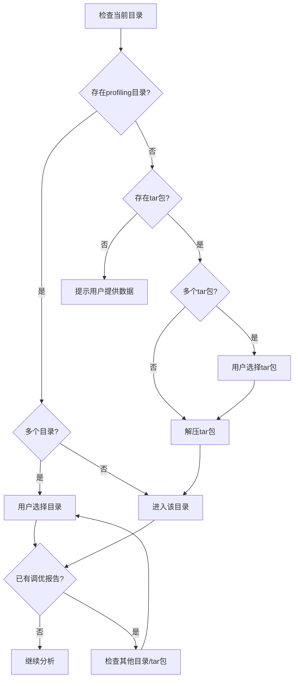
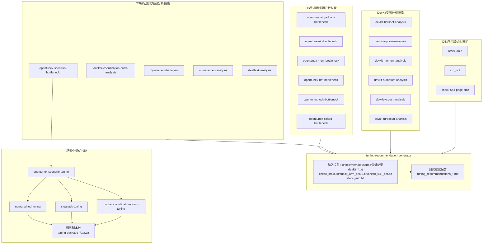

# tuning-recommendation-generator — 系统调优建议生成器

本技能整合多个瓶颈分析技能的输出结果，生成结构化的调优建议报告，并以Markdown表格形式落盘。
注意：优先加载子技能再读取数据文件，因为子技能可能包含解析数据的脚本。

---

## 工作流程

### Phase 1: 数据收集与验证

**目标**: 验证当前工作目录下是否存在性能分析数据文件，并确定数据完整性。

**数据文件检查列表**:
- `static_info.txt` - 系统环境静态信息 （必需）
- `global_bottleneck.txt` - 全局资源瓶颈识别 (必需)
- `top_processes.txt` - 顶部资源消耗进程 (必需)
- `hotspot_analysis.txt` - 热点函数分析 (必需)
- `syscall_analysis.txt` - 系统调用分析 (必需)
- `microarch_analysis.txt` - 微架构瓶颈分析 (必需)
- `io_metrics_analysis.txt` - I/O瓶颈分析结果
- `lock_trace_analysis.txt` - 锁瓶颈分析结果
- `memory_metrics_analysis.txt` - 内存瓶颈分析结果
- `network_metrics_analysis.txt` - 网络瓶颈分析结果
- `scheduler_trace_analysis.txt` - 调度器瓶颈分析结果
- `cpu_detail_info.txt` - CPU详细信息 (必需)
- `kernel_config_info.txt` - 系统内核配置信息 (必需)
- `pmu_info.txt` - PMU信息  (必需)
- `process_detail_info.txt` - 进程详细信息 (必需)
- `system_detail_info.txt` - 系统详细信息 (必需)
- `container_info.txt` - 容器详细信息 (必需)
- `devkit_hotspot.txt` - devkit热点函数分析
- `devkit_kspect.txt` - 系统静态配置
- `devkit_ksys.txt` - 系统动态性能指标
- `devkit_memory.txt` - 内存性能详细分析
- `devkit_numafast.txt` - NUMA访问流量分析
- `devkit_topdown.txt` - Top-down微架构分析
- `devkit_turbostat.txt` - CPU频率和功耗温度
- `software.txt` - 软件版本数据分析
- `supple_data.txt` - 补充数据辅助分析
- `check_kraio.txt` - KRAIO 网络异步优化检测
- `check_arm_crc32.txt` - ARM CRC32 指令加速检测
- `check_64k_opt.txt` - ARM 64K 页大小检测

**执行步骤**（决策流程）:



详细步骤:
1. 列出当前目录下的所有数据文件
2. 检查必需文件是否存在
3. 按上述流程处理多目录/tar包情况
4. 若无数据文件，提示用户提供

**输出**: 数据完整性报告（缺失文件列表）

---

### Phase 2: 分析技能调用与数据整合

**目标**: 根据现有数据文件，调用相应的瓶颈分析技能进行深度分析。
**约束**: 罗列的技能都需要调用，不可跳过步骤，不得复用历史分析结果。

**技能调用策略**:

#### 2.1 OS级瓶颈分析技能

OS级瓶颈分析分为两类：**通用瓶颈分析**与**场景化瓶颈分析**，二者为并列关系，先通用后场景化。

##### 2.1.1 通用瓶颈分析

调用 opentunex-top-down-bottleneck 技能，分析OS级整体性能瓶颈：

| 需要的数据文件 | 调用技能 | 分析维度 |
|---------------|---------|---------|
| `static_info.txt`        | `opentunex-top-down-bottleneck` | 静态配置信息分析 |
| `global_bottleneck.txt`  | `opentunex-top-down-bottleneck` | 全局资源瓶颈分析 |
| `top_processes.txt`      | `opentunex-top-down-bottleneck` | top资源消耗进程分析 |
| `hotspot_analysis.txt`   | `opentunex-top-down-bottleneck` | 热点函数分析 |
| `syscall_analysis.txt`   | `opentunex-top-down-bottleneck` | 系统调用分析 |
| `microarch_analysis.txt` | `opentunex-top-down-bottleneck` | 微架构瓶颈分析 |

调用深度分析技能，识别细化性能瓶颈点，提取瓶颈状态、瓶颈子类型、关键证据、根因推断、OS级建议：

| 需要的数据文件 | 调用技能 | 分析维度 |
|---------------|---------|-------------|
| `io_metrics_analysis.txt`      | `opentunex-io-bottleneck`    | I/O瓶颈分析  |
| `lock_trace_analysis.txt`      | `opentunex-lock-bottleneck`  | 锁瓶颈分析   |
| `memory_metrics_analysis.txt`  | `opentunex-mem-bottleneck`   | 内存瓶颈分析 |
| `network_metrics_analysis.txt` | `opentunex-net-bottleneck`   | 网络瓶颈分析 |
| `scheduler_trace_analysis.txt` | `opentunex-sched-bottleneck` | 调度瓶颈分析 |

##### 2.1.2 场景化瓶颈分析
调用 `opentunex-scenario-bottleneck` 技能，进一步识别特定场景下的性能瓶颈（如NUMA不均衡、Docker容器CPU限流、SMT超线程干扰、窃取任务调度等）。

> **数据流**：将 Phase 1 确定的工作目录路径作为数据源传入该技能，分析报告输出至 `${WORK_DIR}/analysis/` 目录（具体路径参见该技能定义）。

- **技能类型**：纯协调器，全量调度所有场景分析子技能并行执行
- **调度方式**：扫描 `opentunex-scenario-bottleneck/` 目录下所有 `opentunex-*` 前缀的子技能，全量并行调用
- **输出**：场景分析汇总表、瓶颈链分析、综合结论与优先级排序

| 场景分类 | 子技能 | 适用场景 |
|---------|--------|---------|
| 容器算力统筹 | `opentunex-docker-coordination-burst-analysis` | 容器CPU配额不足、宿主机有空闲算力、Docker突发限流 |
| 动态SMT | `opentunex-dynamic-smt-analysis` | CPU使用率低、超线程干扰、低负载场景SMT优化 |
| NUMA分析 | `opentunex-numa-sched-analysis` | NUMA内存不均衡、跨NUMA访问率高 |
| 窃取任务 | `opentunex-stealtask-analysis` | CPU高负载、负载不均衡、调度优化 |

**场景化分析执行策略**：
1. 全量调度所有场景分析子技能，不做选择性过滤（各子技能自行判断适用性）
2. 各子技能根据自身决策矩阵输出"适用/收益有限/不适用"结论
3. 汇总所有场景分析结果，识别瓶颈之间的因果链
4. 输出场景分析汇总报告，按 P0-Critical → P3-Low 排序

#### 2.2 DevKit专项分析技能

根据DevKit数据文件的存在情况，调用对应的专项分析技能：

| 数据文件 | 触发条件             | 调用技能 | 分析维度 |
|---------|------------------|---------|---------|
| `devkit_hotspot.txt` | 文件存在             | `devkit-hotspot-analysis` | 热点函数分析 |
| `devkit_topdown.txt` | 文件存在             | `devkit-topdown-analysis` | 微架构瓶颈分析 |
| `devkit_memory.txt` | 文件存在             | `devkit-memory-analysis` | 内存性能分析 |
| `devkit_numafast.txt` | 文件存在             | `devkit-numafast-analysis` | NUMA访问分析 |
| `devkit_kspect.txt` | **文件存在或检测到配置警告** | `devkit-kspect-analysis` | **系统配置分析（重要）** |
| `devkit_turbostat.txt` | 文件存在             | `devkit-turbostat-analysis` | 功耗散热分析 |

**DevKit技能调用优先级**:
1. **Critical优先**: 
   - `devkit-topdown-analysis` (IPC < 0.5, Backend Bound > 70%)
   - `devkit-memory-analysis` (L2D Miss > 40%, NUMA节点差异 > 50%)
   - `devkit-numafast-analysis` (NUMA Score < 0.5)

2. **High次优**:
   - `devkit-hotspot-analysis` (热点函数集中度 > 70%)
   - `devkit-topdown-analysis` (Frontend Bound > 50%)
   - **`devkit-kspect-analysis`（内存插法警告、网卡NUMA归属问题、BIOS配置问题）**

3. **Medium最后**:
   - `devkit-turbostat-analysis`

**特别注意**:
- `devkit-kspect-analysis`技能必须调用，用于检测系统静态配置问题
- 该技能可识别内存插法问题、网卡NUMA归属问题、BIOS配置问题等
- 配置问题可能导致严重的性能瓶颈，必须优先处理

**执行步骤**:
1. 检查DevKit数据文件完整性
2. **首先调用** `opentunex-top-down-bottleneck` 进行OS级通用瓶颈分析和深度分析（Phase 2.1）
3. **检查OS级分析结果文件**（io_metrics_analysis.txt, lock_trace_analysis.txt, memory_metrics_analysis.txt, network_metrics_analysis.txt, scheduler_trace_analysis.txt）
4. **【必须调用】Skill `opentunex-scenario-bottleneck`** 进行场景化瓶颈分析（Phase 2.1），识别特定场景下的性能瓶颈
5. **【必须调用】Skill `devkit-kspect-analysis`** 提取系统静态配置信息（内存插法、网卡NUMA归属、BIOS配置）
6. 根据关键指标判定瓶颈类型
7. 如果不存在分析结果文件，选择性调用OS级通用深度分析技能（Phase 2.1.1）
8. 选择性调用DevKit专项分析技能（Phase 2.2）
9. **检查DB/应用级检测文件**，按 Phase 2.3 策略调用 `redis-kraio`、`crc_opt`、`check-64k-page-size`
10. 收集并整合所有分析结果（**包括场景化分析结果、devkit-kspect-analysis的系统配置分析和DB/应用级优化建议**）
11. 进入Phase 3进行瓶颈识别与排序（**含场景化分析结果筛选：不适用/不建议启动的直接丢弃**）

**重要提示**: 
- 【强制】Phase 2 必须依次调用 opentunex-top-down-bottleneck → opentunex-scenario-bottleneck，即使前序分析未发现明显瓶颈，场景化分析仍必须执行
- 如果数据文件已包含完整的瓶颈分析结果（如 io_metrics_analysis.txt），则无需重新运行技能，直接提取分析结果即可
- 如果用户已提供完整的数据采集文件（包括分析结果文件），直接进行Phase 3的分析整合
- **场景化瓶颈分析**在通用分析之后执行，场景化分析全量调度所有子技能，各子技能自行判断适用性，不遗漏任何潜在瓶颈
- DevKit专项技能提供更细粒度的分析，可深度定位具体瓶颈函数或微架构问题
- **必须调用devkit-kspect-analysis检测系统配置问题**（内存插法、网卡归属等），配置问题可能导致严重性能瓶颈
- 建议根据关键指标选择性调用专项技能，再整合到调优建议表格
- OS级分析结果文件（io_metrics_analysis.txt等）提供完整的瓶颈分析证据链，优先使用这些文件

#### 2.3 DB/应用级优化技能

根据DB/应用级检测数据文件的存在情况，调用对应的优化建议技能：

| 数据文件 | 触发条件 | 调用技能 | 分析维度 |
|---------|---------|---------|---------|
| `check_kraio.txt` | 文件存在 | `redis-kraio` | Redis KRAIO 网络异步优化 |
| `check_arm_crc32.txt` | 文件存在 | `crc_opt` | ARM CRC32 指令编译优化 |
| `check_64k_opt.txt` | 文件存在 | `check-64k-page-size` | ARM 64K 内核页优化 |

**DB/应用技能执行策略**：
1. 文件存在即触发，各技能自行判断内部适用性（如已使能则输出"无需操作"）
2. 这些技能生成的优化建议属于**应用使能/配置级**，与系统瓶颈无因果关系，独立纳入最终报告
3. 技能内部会根据检测结果自行决定是否输出建议，generator 汇总结果即可

**特别注意**：
- KRAIO 和 CRC32 优化仅适用于鲲鹏 aarch64 平台
- 64K 内核页优化仅适用于 aarch64 平台
- 数据库/大数据场景中，这些优化可能带来显著性能提升（10-30%+）
- 各技能自行验证适用性，generator 汇总结果即可

---

### Phase 3: 瓶颈识别与优先级排序

**目标**: 从所有分析结果中识别出关键瓶颈，并按严重程度排序。

**瓶颈分类标准**:

| 严重程度 | 定义 | 示例 |
|---------|------|------|
| **Critical** | 资源完全饱和，系统几乎无法响应 | CPU 100%，磁盘util 100%，Swap已用 |
| **High** | 性能严重下降，但系统仍可运行 | I/O等待 > 100ms，网络重传 > 10%，LLC缺失率 > 30% |
| **Medium** | 性能轻微下降，影响用户体验 | 缓存缺失率 10-30%，分支预测失败率 5-10% |
| **Low** | 次优状态，但不是瓶颈 | 上下文切换稍高，但未达到阈值 |

**瓶颈影响评估**:
1. 识别主要瓶颈（Primary Bottleneck）
2. 识别次要瓶颈（Secondary Bottlenecks）
3. 分析瓶颈之间的因果关系（Bottleneck Chain）

**场景化分析结果筛选规则**：
> 场景化瓶颈分析的子技能可能输出"适用""收益有限""不适用""不建议启动"等结论。在进入 Phase 4 生成调优建议前，必须按以下规则筛选：
>
> | 结论类型 | 处理方式 |
> |---------|---------|
> | **适用** | 纳入调优建议，在最终报告中体现 |
> | **收益有限** | 可简要提及但不纳入调优建议正文 |
> | **不适用 / 不建议启动 / 特性未开启且不建议启用** | **直接丢弃，不体现在最终报告中** |
>
> 场景化分析的作用是发现值得启动的特性或需要调整的配置。如果某个特性系统本身未开启，且分析结论也不建议启动，则与当前系统无关，不应在报告中占用篇幅。报告只呈现"存在瓶颈需要解决"或"已开启特性需要调优"的场景。

---

### Phase 4: 调优方案生成

**目标**: 为每个识别的瓶颈生成具体的调优建议，包括参数调整和执行步骤。

**调优建议结构**:

每条调优建议包含以下5个关键字段：

1. **瓶颈描述**: 详细描述瓶颈现象、位置、影响范围
2. **调优方案**: 概述调优方向和预期效果
3. **关联的性能数据**: 列出支撑该瓶颈分析的具体指标和数值
4. **关联的调优手段**: 列出所有相关的系统参数、内核参数或配置项以及调优手段
5. **具体的执行步骤**: 提供可执行的操作命令，备注中包含脚本名称和下载链接

- 每个参数调整都要提供安全注意事项
- **特别关注devkit-kspect-analysis识别的配置问题**（如内存插法警告）
- **根据software.txt和supple_data.txt对调优建议中的软件参数做修正**（避免软件版本不同，导致调优建议的命令有误）
- **DB/应用使能级优化建议**独立于系统瓶颈，但需纳入最终报告；若相关检测文件不存在或结论为"已使能"，则不生成对应建议

---

### Phase 5: 调优建议表格生成与落盘

> **【强制】最终报告必须且仅由本 Phase 5 生成，遵循本 SKILL.md 定义的模板格式。**
>
> **禁止事项**：
> - **禁止**将 `opentunex-scenario-tuning` 内部报告模板的输出作为最终报告交付
> - **禁止**以大模型自组织的 Markdown 格式替代本模板
> - **禁止**添加模板中未定义的章节、表格或字段（如"已生效调优""系统基线""产出数据索引"等）
> - **禁止**将调优建议以 JSON、纯文本或其他非表格 Markdown 格式输出
>
> **正确做法**：从所有分析技能的输出中提取信息，严格按照下方模板的结构和字段填充，**剔除重复的调优建议**，输出文件名为 `tuning_recommendations_YYYYMMDD_HHMMSS.md`。

**目标**: 生成结构化的Markdown表格，并保存到文件。

**输出格式**:

```markdown
# 系统调优建议报告

**生成时间**: YYYY-MM-DD HH:MM:SS
**系统环境**: [从static_info.txt提取]
**主要瓶颈**: [Primary Bottleneck]

## 调优建议汇总表

| 瓶颈描述 | 调优方案 | 关联的性能数据 | 关联的调优手段 | 具体的执行步骤 | 调用的技能 |
|---------|---------|--------------|-------------------|--------------|-----------|
| [瓶颈1描述] | [方案1] | [数据1] | [调优手段1] | [步骤1] | [技能1] |
| [瓶颈2描述] | [方案2] | [数据2] | [调优手段2] | [步骤2] | [技能2] |
| ... | ... | ... | ... | ... | ... |

## 详细执行步骤

### 建议1: [瓶颈名称]

**问题描述**:
[详细描述瓶颈现象]

**性能证据**:
```
[相关数据文件中的具体输出]
```

**调整参数**:
- 参数1: 说明
- 参数2: 说明

**执行步骤**:
```bash
# 步骤1: 命令
command1

# 步骤2: 命令
command2
```

**安全注意事项**:
- 注意事项1
- 注意事项2

**预期效果**:
[描述预期的性能改善]

---

### 建议2: [瓶颈名称]
...
```

**落盘文件名**: `tuning_recommendations_YYYYMMDD_HHMMSS.md`

---

## 执行脚本参考

参考 `scripts/generate-recommendations.sh` 获取自动化脚本。

---

## 与其他技能的协作关系

### 协作关系图



### 协作流程

#### 流程1: OS级瓶颈分析 → 调优建议

```
[opentunex-top-down-bottleneck] ──┐
[opentunex-io-bottleneck] ────────┤ → io_metrics_analysis.txt
[opentunex-mem-bottleneck] ───────┤ → memory_metrics_analysis.txt ──┐
[opentunex-net-bottleneck] ───────┤ → network_metrics_analysis.txt    │
[opentunex-lock-bottleneck] ──────┤ → lock_trace_analysis.txt         ├──> [tuning-recommendation-generator] ──> 调优建议
[opentunex-sched-bottleneck] ┘ → scheduler_trace_analysis.txt    │
                                  │
                                  └──> 提取分析结果文件关键信息 ────────┘
```

适用场景：系统级瓶颈分析，生成OS参数调优建议

**分析结果文件优先使用策略**:
- 如果已存在 io_metrics_analysis.txt，直接读取提取I/O瓶颈信息
- 如果已存在 lock_trace_analysis.txt，直接读取提取锁瓶颈信息
- 如果已存在 memory_metrics_analysis.txt，直接读取提取内存瓶颈信息
- 如果已存在 network_metrics_analysis.txt，直接读取提取网络瓶颈信息
- 如果已存在 scheduler_trace_analysis.txt，直接读取提取调度器瓶颈信息
- 避免重复调用技能，提高分析效率

#### 流程2: OS级瓶颈分析 + 场景化分析 → 综合瓶颈报告

```
[opentunex-top-down-bottleneck] ──→ OS级通用瓶颈分析
         ↓
[opentunex-scenario-bottleneck] ──→ 场景化瓶颈分析
    ├── [opentunex-docker-coordination-burst-analysis]
    ├── [opentunex-dynamic-smt-analysis]
    ├── [opentunex-numa-sched-analysis]
    └── [opentunex-stealtask-analysis]
         ↓
   场景分析汇总报告 + 瓶颈链分析
```

适用场景：在通用瓶颈分析基础上，识别特定场景下（容器、NUMA、调度等）的潜在瓶颈

#### 流程3: DevKit专项分析 → 调优建议

```
[devkit-hotspot-analysis] ────┐
[devkit-topdown-analysis] ────┤
[devkit-memory-analysis] ─────┤──> [tuning-recommendation-generator] ──> 调优建议
[devkit-numafast-analysis] ───┤    （含编译器级和应用级建议）
[devkit-kspect-analysis] ─────┤
[devkit-turbostat-analysis] ──┘
```

适用场景：深度分析，生成函数级、微架构级、编译器级调优建议

#### 流程4: 场景化调优 → 调优脚本

```
[opentunex-scenario-tuning] ──→ 读取瓶颈分析融合报告
    ├── [opentunex-numa-sched-tuning] ──→ NUMA调度调优脚本
    ├── [opentunex-stealtask-tuning] ──→ 窃取任务调优脚本
    └── [opentunex-docker-coordination-burst-tuning] ──→ Docker突发调优脚本
         ↓
   场景化调优建议 + 打包调优脚本集
```

适用场景：针对场景化瓶颈分析结果，生成具体可执行的调优方案和脚本

#### 流程5: OS级 + DevKit专项 → 综合调优建议

```
OS级通用/场景化瓶颈分析 ─────────────┐
                                  │
DevKit专项技能分析 ─────────────────┤──> [tuning-recommendation-generator]
                                  │    （整合OS级 + 微架构级 + 应用级）
                                  │
                                  ↓
            综合调优建议报告 + 调优脚本包
```

适用场景：最完整的调优建议，包含系统、编译器、应用三个层面

#### 流程6: DB/应用级使能优化 → 调优建议

```
[redis-kraio] ─────── check_kraio.txt → KRAIO 异步IO使能建议 ──┐
[crc_opt] ─────────── check_arm_crc32.txt → CRC32 编译建议 ────┤──> [tuning-recommendation-generator] ──> 调优建议
[check-64k-page-size] ─ check_64k_opt.txt → 64K 内核页建议 ────┘    (DB/应用使能级建议)
```

适用场景：数据库/大数据场景下的使能优化（独立于系统瓶颈，无需前置分析）

## 注意事项

1. **子智能体脚本传递【关键】**: 当使用 `delegate_task` 启动子智能体执行分析技能时，子智能体运行在隔离上下文中，**无法调用 `skill_view`/`skill_manage` 等技能工具**，因此无法自行获取技能目录下的预处理脚本。仅传入技能名称（如"devkit-kspect-analysis"），子智能体会跳过脚本预处理步骤，直接读取原始数据文件自行推理，导致：数据量放大4-5倍（未经脚本过滤压缩）、决策路径未经脚本结构化校验、分析耗时增加2-3倍。

   **正确做法（脚本路径前置传递）**：
   - 在父上下文中，**先通过 `skill_view(name='<技能名>', file_path='scripts/<脚本名>')` 获取脚本绝对路径**
   - 在 `delegate_task` 的 `context` 参数中，**显式写入脚本绝对路径和执行命令**，而非仅引用技能名称
   - 子智能体收到的 context 中必须包含明确的执行步骤："步骤1: 执行脚本 → 步骤2: 读取脚本输出 → 步骤3: 分析"

   **需要脚本预处理的技能清单**：

   | 技能名称 | 脚本 | 用途 | 脚本目录 |
   |---------|------|------|---------|
   | devkit-kspect-analysis | `parse_kspect.sh` | 131KB→30KB结构化提取 | `core/devkit-kspect-analysis/scripts/` |
   | opentunex-numa-sched-analysis | `preanalysis.sh` | PMU HHA/NUMA决策变量提取 | `core/opentunex-scenario-bottleneck/opentunex-numa-sched-analysis/scripts/` |
   | opentunex-stealtask-analysis | `preanalysis.sh` | 调度特性决策变量提取 | `core/opentunex-scenario-bottleneck/opentunex-stealtask-analysis/scripts/` |
   | opentunex-docker-coordination-burst-analysis | `preanalysis.sh` | 容器/cgroup决策变量提取 | `core/opentunex-scenario-bottleneck/opentunex-docker-coordination-burst-analysis/scripts/` |
   | opentunex-dynamic-smt-analysis | `preanalysis.sh` | SMT决策变量提取 | `core/opentunex-scenario-bottleneck/opentunex-dynamic-smt-analysis/scripts/` |
   | opentunex-multi-net-path-analysis | `preanalysis.sh` | 网卡多路径决策变量提取 | `core/opentunex-scenario-bottleneck/opentunex-multi-net-path-analysis/scripts/` |
   | opentunex-soft-domain-analysis | `preanalysis.sh` | 分域调度决策变量提取 | `core/opentunex-scenario-bottleneck/opentunex-soft-domain-analysis/scripts/` |

   **父智能体传递脚本路径的示例模板**：
   ```
   【强制步骤】Phase 1 必须先执行预处理脚本，不可跳过：

   步骤1: 执行脚本生成结构化数据
     bash {SCRIPT_ABS_PATH} {DATA_FILE_ABS_PATH} > {WORK_DIR}/{OUTPUT_FILE}

   步骤2: 读取脚本输出（而非原始数据文件）进行分析
     read_file {WORK_DIR}/{OUTPUT_FILE}

   步骤3-N: 按技能定义的后续Phase逐项分析
   ```

   **脚本绝对路径获取方法**：
   ```
   # 在父上下文中执行 skill_view，返回的 resolved_path 即为脚本绝对路径
   skill_view(name='devkit-kspect-analysis', file_path='scripts/parse_kspect.sh')
   # 返回 resolved_path: /home/<user>/.hermes/skills/core/devkit-kspect-analysis/scripts/parse_kspect.sh
   # 将此路径写入 delegate_task 的 context 参数
   ```

2. **数据完整性**: 确保有足够的数据文件进行分析，否则建议先提供完整的数据包或目录
3. **分析结果文件优先**: 如果存在 io_metrics_analysis.txt、lock_trace_analysis.txt、memory_metrics_analysis.txt、network_metrics_analysis.txt、scheduler_trace_analysis.txt 等分析结果文件，优先读取提取关键信息，避免重复调用技能
4. **参数安全**: 所有参数调整都需提供安全注意事项，避免系统不稳定
5. **优先级排序**: Critical和High级别的瓶颈优先处理
6. **瓶颈关联**: 注意分析瓶颈之间的因果关系，优先解决根本原因
7. **证据支持**: 所有调优建议必须有具体的性能数据支撑，不能凭空推测
8. **DevKit技能优先级**: 优先调用Critical级别的DevKit技能（IPC < 0.5, Backend Bound > 70%）
9. **编译器建议适配**: BiSheng编译器优化参数针对Kunpeng-920，其他编译器需参考相应文档
10. **多层级整合**: 建议同时使用OS级和DevKit技能，生成更完整的调优方案
11. **文件提取规范**: 从分析结果文件中提取关键信息时，保持原有格式和完整性，提取瓶颈状态、关键证据、根因推断、建议列表等关键字段

## 技能版本信息

### OS级通用技能版本

| 技能名称 | 版本 | 适用平台 |
|---------|------|---------|
| opentunex-top-down-bottleneck | 1.0 | Linux通用 |
| opentunex-io-bottleneck | 1.0 | Linux通用 |
| opentunex-mem-bottleneck | 1.0 | Linux通用 |
| opentunex-net-bottleneck | 1.0 | Linux通用 |
| opentunex-lock-bottleneck | 1.0 | Linux通用 |
| opentunex-sched-bottleneck | 1.0 | Linux通用 |

### OS级场景化技能版本

| 技能名称 | 版本 | 适用平台 |
|---------|------|---------|
| opentunex-scenario-bottleneck | 1.0 | Linux通用 |
| opentunex-scenario-tuning | 1.0 | Linux通用 |
| opentunex-docker-coordination-burst-analysis | openEuler内核5.10/6.6 | Linux通用 |
| opentunex-dynamic-smt-analysis | openEuler内核5.10 | Linux通用 |
| opentunex-numa-sched-analysis | openEuler内核5.10/6.6 | Linux通用 |
| opentunex-stealtask-analysis |openEuler内核5.10/6.6 | Linux通用 |
| opentunex-numa-sched-tuning | openEuler内核5.10/6.6 | Linux通用 |
| opentunex-stealtask-tuning | openEuler内核5.10/6.6 | Linux通用 |
| opentunex-docker-coordination-burst-tuning | openEuler内核5.10/6.6 | Linux通用 |

### DevKit技能版本

| 技能名称 | 版本 | 适用平台 | DevKit版本 |
|---------|------|---------|-----------|
| devkit-hotspot-analysis | 1.0 | Kunpeng-920 | 26.0.RC1 |
| devkit-topdown-analysis | 1.0 | Kunpeng-920 | 26.0.RC1 |
| devkit-memory-analysis | 1.0 | Kunpeng-920 | 26.0.RC1 |
| devkit-numafast-analysis | 1.0 | Kunpeng-920 | 26.0.RC1 |
| devkit-kspect-analysis | 1.0 | Kunpeng-920 | 26.0.RC1 |
| devkit-turbostat-analysis | 1.0 | Kunpeng-920 | 26.0.RC1 |

### DB/应用级优化技能版本

| 技能名称 | 版本 | 适用平台 |
|---------|------|---------|
| redis-kraio | 1.0 | Kunpeng aarch64 |
| crc_opt | 1.0 | Kunpeng aarch64 |
| check-64k-page-size | 1.0 | Kunpeng aarch64 |

### 本技能版本

- **tuning-recommendation-generator**: v2.4
- **更新日期**: 2026-07-28
- **新增功能**: 
  - 整合 osentunex-scenario-bottleneck 场景化瓶颈分析技能（Phase 2.1 第二步）
  - 整合 osentunex-scenario-tuning 场景化调优技能（Phase 4 OS级别参数）
  - 支持全量场景调度：容器协调突发、动态SMT、NUMA分析、窃取任务
  - 支持场景化调优：numa并行感知调度优化、窃取任务调度优化、Docker算力统筹优化
  - **整合 redis-kraio、crc_opt、check-64k-page-size DB/应用级使能优化技能（Phase 2.3）**
  - **支持 Redis KRAIO 异步IO、ARM CRC32 编译优化、ARM 64K 内核页等数据库场景使能优化**
  - **v2.4: 新增注意事项1"子智能体脚本传递"规范，明确7个预处理脚本的路径前置传递流程，避免子智能体跳过脚本导致数据量放大和决策路径偏离**
- **支持平台**: Linux通用 + Kunpeng-920

---

## 平台支持

### Linux通用平台

支持的OS级技能：
- opentunex-top-down-bottleneck
- opentunex-io-bottleneck
- opentunex-mem-bottleneck
- opentunex-net-bottleneck
- opentunex-lock-bottleneck
- opentunex-sched-bottleneck

适用场景：任何Linux系统的性能分析和调优

### Kunpeng-920平台

支持的DevKit技能：
- devkit-hotspot-analysis
- devkit-topdown-analysis
- devkit-memory-analysis
- devkit-numafast-analysis
- devkit-kspect-analysis
- devkit-turbostat-analysis

支持的DB/应用级优化技能：
- redis-kraio (KRAIO 异步IO)
- crc_opt (CRC32 编译优化)
- check-64k-page-size (64K 内核页)

适用场景：华为Kunpeng-920平台的深度性能分析和调优

**Kunpeng-920特性**:
- CPU: 128核, 2 NUMA节点
- IPC正常范围: 0.5-2.0
- DDR瓶颈值: ~12500 MB/s
- 编译器: BiSheng编译器优化参数
- NUMA优化: numactl绑定策略
- **ARM CRC32 硬件加速**: 需 `-march=armv8-a+crc` 编译选项
- **KRAIO 异步IO**: 需鲲鹏 BoostKit 和 libkraio.so
- **64K 内核页**: 减少 TLB miss，提升数据库场景性能

---

## 调优建议层级总结

| 调优层级 | 分析技能 | 调优参数类型 | 预期效果 |
|---------|---------|------------|---------|
| **系统级** | OS级通用+场景化分析技能 | sysctl, 内核参数, I/O调度器;NUMA调度, Steal Task, Docker等优化特性 | 系统资源配置优化、特定场景瓶颈优化 |
| **编译器级** | DevKit技能 | BiSheng编译器参数, prefetch参数 | IPC提升, Cache命中率提升 |
| **应用级** | DevKit技能 | 代码优化, NUMA绑定, 内存池 | 函数性能提升, 内存访问优化 |
| **DB/应用使能级** | redis-kraio, crc_opt, check-64k-page-size | LD_PRELOAD, 编译选项, 内核页配置 | Redis吞吐提升, CRC加速, TLB miss降低 |

**最佳实践**: 同时使用四个层级技能，生成最完整的调优方案
